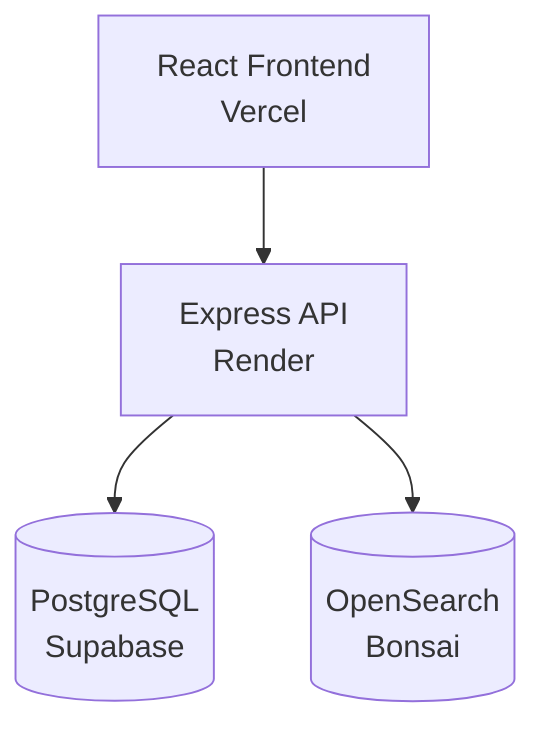

# the-score-archives

Search film scores by composer, mood, and instrumentation. Built with TypeScript, Node.js, PostgreSQL, OpenSearch, and React.

[Try It Out](https://the-score-archives.vercel.app/) · [API](https://the-score-archives.onrender.com)

---

## Overview
- Relevance-ranked results — composer, mood, and title matches outrank overview matches
- Horizontal reel interface with infinite scroll pagination
- Click any film to see the full metadata

---

## Architecture


## Tech Stack

**Backend**
- TypeScript, Node.js, Express
- PostgreSQL (Supabase) — relational persistence
- OpenSearch (Bonsai) — full-text search index
- Docker + Docker Compose — local development

**Frontend**
- React, TypeScript, Vite — deployed on Vercel

**Testing**
- Jest + Supertest — integration tests for all API endpoints

---

## Data Pipeline

Each record is enriched from three external sources:
- **TMDB** — film title, year, director, composer, genres, overview, poster
- **Wikidata SPARQL** — music-related awards and nominations
- **OpenAI (gpt-4o-mini)** — mood tags and instrumentation (inferred)

Films with no composer credit in TMDB are skipped.

---

## Design Decisions

**Dual-write over async queue** — writes to Postgres and OpenSearch happen synchronously in the same ingest operation; keeps implementation simple and ensures consistency.

**SPARQL over REST for awards** — Wikidata's SPARQL endpoint lets you query by IMDb ID and traverse award relationships in a single request; REST approach would require multiple chained calls.

**Generated soft tags** — TMDB provides composer credits but not mood or instrumentation. The seed script uses OpenAI to infer these from film metadata.

**Weighted search fields in OpenSearch** — composer 8x, mood 7x, title 6x, instruments 5x, genre 3x, overview 1x.

---

## API Endpoints

### Search films
```
GET /search?q=dark atmospheric zimmer&page=1&limit=20
```

Response:
```json
{
  "results": [...],
  "total": 847,
  "count": 20,
  "page": 1,
  "limit": 20,
  "pages": 43
}
```

### Get film by ID
```
GET /search/film/:id
```

### Ingest a film
```
POST /ingest
Content-Type: application/json

{
  "tmdb_id": 157336,
  "title": "Interstellar",
  "composers": ["Hans Zimmer"],
  ...
}
```

---

## Deployment

| Service | Platform |
|---------|----------|
| React frontend | Vercel |
| Node.js API | Render |
| PostgreSQL | Supabase |
| OpenSearch | Bonsai |

Docker Compose is used for local development only. In production each service is managed independently.

---

## Running Locally

```bash
# Backend (requires Postgres + OpenSearch — see backend/docker-compose.yml)
cd backend && npm install && npm run start

# Frontend
cd frontend && npm install && npm run dev
```

Frontend runs at `http://localhost:5173`. Set `VITE_API_BASE_URL` in `frontend/.env` and TMDB / OpenAI / DB credentials in `backend/.env`.

### Seed the database
```bash
# (~1k films, takes several minutes)
cd backend && npm run seed
```

### Run tests
```bash
cd backend && npm test
```

---

Built by [@ipidara](https://github.com/ipidara).